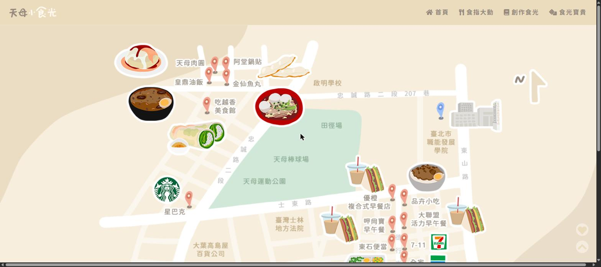

# 🍜 天母小食光

天母小食光是一個美食地圖網站，收錄台北市士林區天母一帶的餐廳資訊，幫助職能發展學院的學員們快速找到午餐選擇，解決每天「中午吃什麼」的煩惱。

## 🖥️ 頁面展示

### 首頁 — 美食地圖


### 美食列表 — 篩選與排序


### 創作食光 — 關於我們


## ✨ 功能列表

- **美食列表瀏覽** — 瀏覽 16 間天母周邊餐廳，含店家照片、餐點照片、菜單、地址、電話與營業時間
- **分類篩選** — 依「早午餐」、「中式美食」、「外國美食」三種類別篩選店家
- **多維度排序** — 可依價格、評價、距離進行升冪或降冪排序
- **隨機推薦** — 「食光寶貴」功能，隨機挑選一間餐廳，幫你解決選擇困難
- **收藏功能** — 點擊愛心收藏喜歡的店家，集中於側邊欄檢視
- **店家詳情頁** — 每間餐廳獨立頁面，包含 Google Maps 嵌入地圖、菜單與多張照片
- **留言功能** — 在「創作食光」頁面留下對網站的回饋
- **合作洽詢** — 「合作小食光」頁面提供店家合作資訊
- **RWD 響應式設計** — 支援電腦版與手機版瀏覽

## 🛠️ 技術棧

| 類別 | 技術 |
|------|------|
| 結構 | HTML5 |
| 樣式 | Sass (`.sass` 語法)、Bootstrap 5 |
| 互動 | JavaScript (ES6)、jQuery 3.6 |
| 圖示 | Font Awesome 5、Bootstrap Icons、Material Icons |
| 動畫 | Animate.css |
| 字體 | 源泉圓體 |

## 📁 專案結構

```
tianmu-food-moments/
├── index.html              # 首頁（地圖 + 輪播圖）
├── list.html               # 美食列表（篩選 + 排序）
├── aboutus.html            # 關於我們（故事 + 團隊成員）
├── cooperation.html        # 合作洽詢
├── restaurant/             # 各店家詳情頁 (共 16 間)
│   ├── 1阿堂鍋貼.html
│   ├── 2麥當勞.html
│   └── …
├── css/
│   └── asemble.css         # 編譯後的樣式表
├── sass/                   # Sass 原始檔
│   ├── asemble.sass        # 主檔（匯入所有模組）
│   ├── _variable.sass      # 變數定義
│   ├── _reset.sass         # Reset 樣式
│   ├── _header.sass        # 頁首
│   ├── _footer.sass        # 頁尾
│   ├── _index.sass         # 首頁
│   ├── _list.sass          # 列表頁
│   ├── _restaurant.sass    # 店家詳情頁
│   ├── _about.sass         # 關於頁
│   └── _cooperation.sass   # 合作頁
├── js/                     # JavaScript
│   ├── header&footer.js    # 頁首頁尾共用元件 + 路徑偵測
│   ├── card&sort.js        # 店家卡片渲染、篩選與排序
│   ├── collect&random.js   # 收藏與隨機推薦
│   ├── random_box&bottom_button.js  # 隨機彈窗與常駐按鈕
│   ├── restaurant.js       # 店家詳情頁邏輯
│   └── textarea.js         # 留言區功能
├── image/                  # 圖片資源
│   ├── store/              # 店家外觀照
│   ├── food/               # 餐點照片
│   ├── menu/               # 菜單照片
│   └── member/             # 團隊成員照片
├── screenshots/            # README 展示用截圖
└── .gitignore
```